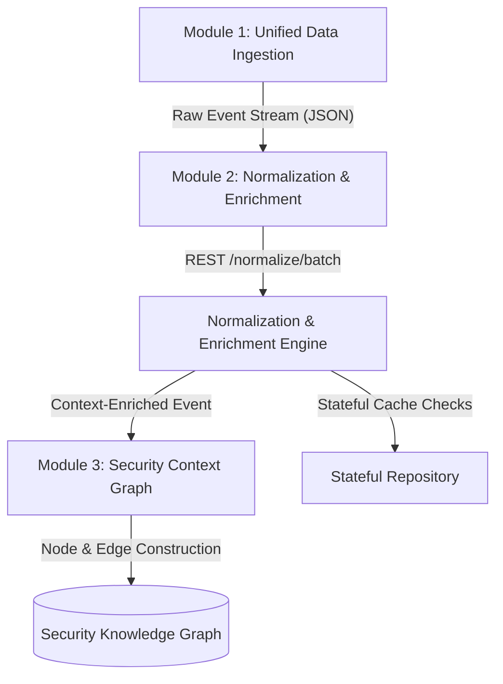
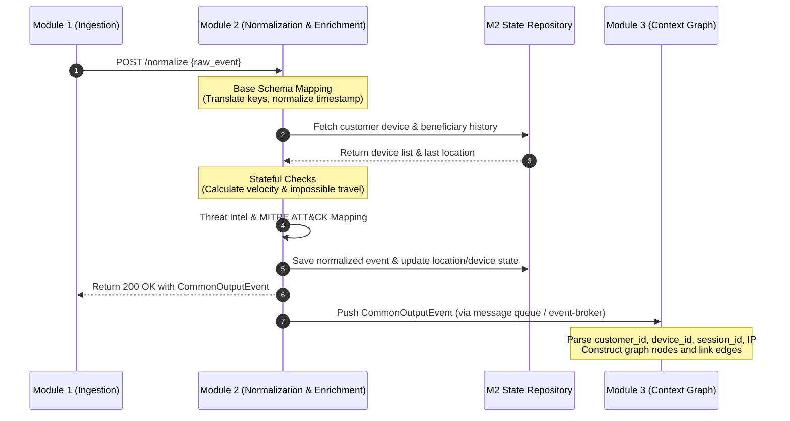

# FALCON Module Integration Guide

This guide explains how **Module 1 (Unified Data Ingestion Layer)** sends data into **Module 2 (Event Normalization & Threat Enrichment Layer)**, and how **Module 2** forwards the standardized output stream to **Module 3 (Security Context Graph)**.

---

## Architecture Flow



---

## Sequence Diagram

The following sequence diagram outlines a single transaction event workflow from ingestion to knowledge graph edge construction:



---

## Integration Details

### Upstream (Module 1 -> Module 2)

Module 1 collects events and POSTs them to Module 2.

#### Example Integration Code (Python)
```python
import httpx
import asyncio

MODULE2_URL = "http://localhost:8000/normalize"

async def forward_event_to_module2(raw_event: dict):
    async with httpx.AsyncClient() as client:
        try:
            response = await client.post(
                MODULE2_URL,
                json={"event": raw_event},
                timeout=5.0
            )
            if response.status_code == 200:
                enriched_event = response.json()
                print(f"Normalized Event ID: {enriched_event['metadata']['event_id']}")
                return enriched_event
            else:
                print(f"Error from Module 2: {response.status_code} - {response.text}")
        except Exception as e:
            print(f"Failed to reach Module 2: {e}")
```

---

### Downstream (Module 2 -> Module 3)

The output of Module 2 is the **Context-Enriched Event Repository**. Every output event conform to the Pydantic-validated `CommonOutputEvent` structure.

To build the Security Knowledge Graph, Module 3 relies on the preserved identifiers. **Module 2 guarantees that these fields are never modified or altered.**

#### Critical Mapping Identifiers for Module 3
Module 3 maps these keys to build nodes and edges:
* **User/Employee**: `identity.username` and `identity.employee_id`
* **Customer**: `identity.customer_id`
* **Device**: `identity.device_id` / `device.device_id`
* **IP**: `identity.ip_address` / `network.source_ip`
* **Session**: `metadata.session_id` / `identity.session_id`
* **Transaction**: `transaction.transaction_id`
* **Account**: `identity.account_number` / `transaction.account_number`
* **Beneficiary**: `identity.beneficiary_id` / `transaction.beneficiary_id`
* **Endpoint**: `identity.endpoint_id`
* **Malware**: Detected file hashes under `raw_event.file_hash` matched by `threat` indicators.

---

## Merge Compatibility Checklist
* [x] **No Shared Library Conflicts**: Module 2 uses basic libraries (`FastAPI`, `Pydantic-Settings`, `Uvicorn`). It does not dictate database connectors for Modules 1 or 3.
* [x] **Zero Code Changes for Integration**: REST endpoints accept raw JSON dictionaries and output fully parsed schema-matching JSON structures. No custom classes need to be imported across module folders.
* [x] **Decoupled Data Store**: All local lookups and state checks are abstracted via the `StateRepository` interface in `app/database/repository.py`. The in-memory database configuration can be easily swapped with Redis/SQL without modifying the business logic.
