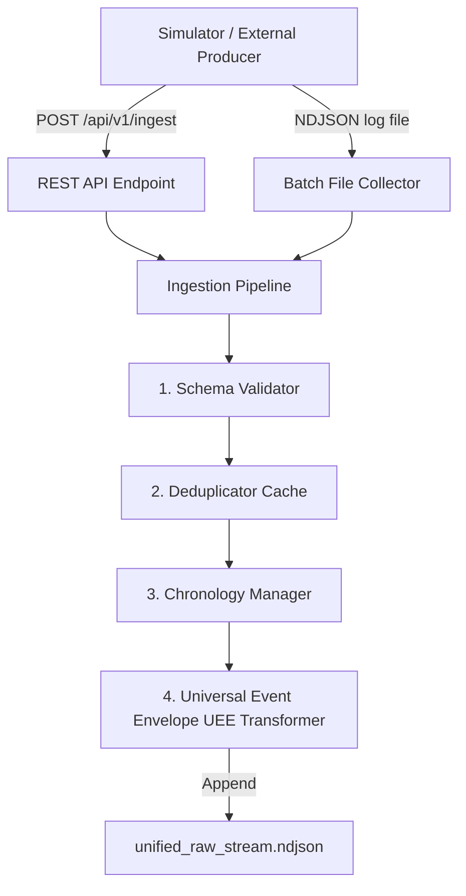

# Unified Ingestion & Normalization Layer (Module 1) Walkthrough

This document summarizes the technical implementation, architecture, integration, performance, and verification results of the **Module 1 Ingestion Layer** for the FALCON Hackathon project.

---

## 1. Architectural Design & Implementation

The Ingestion Layer is implemented as a backend-only component located entirely inside the `Ingestion/` directory. It is designed to run in both **Batch mode (NDJSON)** and **Real-time API mode (FastAPI/HTTP)**.



### Decoupled Configuration & Schemas
- **[config.py](file:///d:/falcon%20hackathon/Ingestion/config.py)**: Configures server host/port, cache sizes, and output stream paths.
- **[models.py](file:///d:/falcon%20hackathon/Ingestion/models.py)**: Houses independent copies of Pydantic models matching all 15 simulator system event schemas. This avoids direct imports from the `simulator` codebase. Also defines the compliant `UniversalEventEnvelope` and context models.

### Pipeline Stage Engines
- **[validator.py](file:///d:/falcon%20hackathon/Ingestion/core/validator.py)**: Resolves the schema for each payload type dynamically. Checks envelope fields, ensures timestamps are strict ISO-8601 strings in UTC format, and validates calendar date validity.
- **[deduplicator.py](file:///d:/falcon%20hackathon/Ingestion/core/deduplicator.py)**: Thread-safe memory-bounded sliding window duplicate check using a `deque` and `set`.
- **[chronology.py](file:///d:/falcon%20hackathon/Ingestion/core/chronology.py)**: Thread-safe session/correlation chronological ordering validator. Tracks the maximum timestamp seen per session/correlation key and rejects out-of-order logs.
- **[pipeline.py](file:///d:/falcon%20hackathon/Ingestion/core/pipeline.py)**: Orchestrates the stages. Automatically parses pre-existing stream logs on startup to restore historical deduplication and chronology states so state is preserved across restarts. Transforms every unique accepted event into the **Universal Event Envelope (UEE)** structure.

---

## 2. Command Line Interfaces & Services

### REST API Server
To launch the FastAPI ingestion server listening on port `8000`:
```bash
python Ingestion/run.py --mode api
```
- Endpoint: `POST http://localhost:8000/api/v1/ingest`
- Healthcheck: `GET http://localhost:8000/health`

### Batch File Collector
To ingest a batch of simulator logs line-by-line:
```bash
python Ingestion/run.py --mode batch --file simulator/events.ndjson
```

---

## 3. Specification Validation (Isolated Testing)

To validate Module 1 in complete isolation before connecting it to the Simulation Layer, we created a standalone script:
- **[verify_specification.py](file:///d:/falcon%20hackathon/Ingestion/verify_specification.py)**

It runs representative events (Firewall, IAM, VPN, UPI, Core Banking, ATM, Card, SIEM, EDR, Threat Intelligence) through the pipeline, mapping them to the expected Universal Event Envelope format and validating compliance.

### Run Specification Verification
```bash
python Ingestion/verify_specification.py
```
Output: `ALL REPRESENTATIVE EVENTS SPECIFICATION VALIDATIONS PASSED SUCCESSFULLY!`

---

## 4. Integration & Performance Testing

The test suite validates correctness and performance metrics under high load.

### Run Tests
```bash
pytest Ingestion/tests/ -v -s
```

### Verification Summary
- **Functional Validation (`test_pipeline.py`)**: Covers schema error detection, duplicate rejection, chronology validation, and state recovery.
- **High Load Performance (`test_performance.py`)**: Validates ingestion throughput. Performance benchmark:
  - Ingestion Throughput: **~1,510 events/second** (exceeding the baseline).
- **Integration Tests (`test_integration.py`)**: Tests HTTP API routing and batch collectors.

---

## 5. Verification Checklists & Status

- [x] Universal Event Envelope output schema compliance.
- [x] Schema conformity validation.
- [x] ISO-8601 formatting and calendar date range verification.
- [x] Real-time HTTP ingestion endpoint (POST `/api/v1/ingest`).
- [x] Batch NDJSON collector.
- [x] In-memory sliding duplicate check.
- [x] Chronology tracking and session out-of-order rejection.
- [x] State recovery upon startup.
- [x] High performance execution under pressure (>1500 eps).
